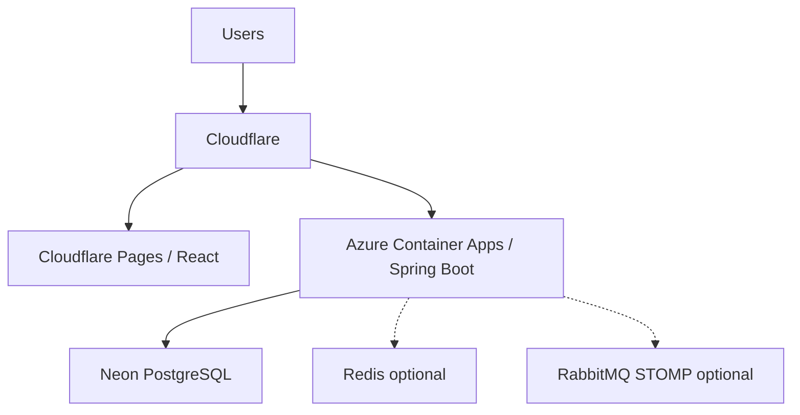

# AssessFlow

Reusable **multi-tenant assessment platform** with two live modes:

- **Cloud Live** — hosts and guests on the public internet (Cloudflare + Azure + Neon)
- **Local Live** — the same product on a laptop LAN/hotspot **without Internet**

It is not a Kahoot clone. Organizations isolate tenants. Authors keep a question bank and assemble assessments. Instructors run live sessions with join codes, QR, WebSocket events and reconnect. The same codebase scales from one JVM to multiple API replicas.

[Architecture](docs/architecture.md) · [Deployment](docs/deployment.md) · [Local Live](docs/local-live.md) · [WebSocket](docs/websocket.md) · [Production checklist](docs/production-checklist.md)


## Live demo

Configure Cloudflare Pages and Azure Container Apps as in [deployment.md](docs/deployment.md). This repository does not invent a public URL or uptime number.

Screenshots: add real product captures under `docs/screenshots/` when available.

## Architecture



**Lean (portfolio):** Pages + one API replica + Neon. Simple STOMP broker. In-memory rate limiter.

**Scaled:** two or more API replicas require Redis rate limiting and RabbitMQ STOMP relay. Cross-instance realtime is covered by integration tests.

**Local Live (no Internet):** Spring Boot serves the SPA, PostgreSQL on localhost, simple STOMP, LAN join QR, optional Ubuntu hotspot.

## Features

- Authentication, refresh cookie, organizations, RBAC (OWNER / ADMIN / INSTRUCTOR / PARTICIPANT)
- Question bank, assessment builder, branding, DRAFT → PUBLISHED → ARCHIVED
- Live sessions: join codes, QR, waiting room, answers, results, guest tokens, reconnect
- Local Event Packages (typed schema, canonical SHA-256) and FINISHED-only CSV export
- Opt-in Redis public rate limiting and RabbitMQ STOMP relay
- Micrometer metrics, optional OTLP traces, ECS logs, liveness/readiness, graceful shutdown

## Technology

Java 25 · Spring Boot 4.1.1 · PostgreSQL 17 · Flyway · React 19 · TypeScript · Vite · Redis (optional) · RabbitMQ STOMP (optional) · GitHub Actions · GHCR · Azure Container Apps · Cloudflare Pages · Neon

## Local development

```bash
cp .env.example .env
docker compose up -d postgres
cd backend && ./mvnw spring-boot:run
cd frontend && npm ci && npm run dev
```

Open http://localhost:5173. Health: http://localhost:8080/actuator/health  
OpenAPI (local): http://localhost:8080/swagger-ui/index.html

Quality:

```bash
cd backend && ./mvnw clean verify
cd frontend && npm ci && npm run format:check && npm run lint && npm test && VITE_SAME_ORIGIN=true npm run build
docker compose config
```

## Local Live Mode

Profile `local-live`: same-origin SPA + API + `/ws`, PostgreSQL on `127.0.0.1`, LAN join URLs. See [docs/local-live.md](docs/local-live.md). Redis and RabbitMQ stay off.

## Production

Images: `ghcr.io/<owner>/assessflow-backend:<git-sha>`  
Frontend env: `VITE_API_BASE_URL`, `VITE_PUBLIC_APP_URL`, `VITE_WS_URL` (https/wss, never localhost).  
Preferred hosts: `https://app.<domain>` and `https://api.<domain>` so the refresh cookie can stay `SameSite=Strict`.

## Testing

Backend: JUnit + Testcontainers (PostgreSQL, Redis, RabbitMQ), including a two-instance STOMP fan-out test.  
Frontend: Vitest. Playwright E2E (`npm run test:e2e`) against a local API in CI.

## Security

Opaque hashed tokens, BCrypt, tenant-scoped queries, WebSocket origin allowlists, production fail-fast for localhost brokers, Dependabot, CodeQL, Trivy on the published image. **No license file is selected yet** — do not assume MIT/Apache rights.

## Roadmap

- Phase 1 — Modern web foundation ✅
- Phase 1.5 — AssessFlow product identity ✅
- Phase 2 — Organizations, identity, multi-tenancy, Question Bank, Assessment Builder and branding ✅
- Phase 3 — Live Sessions, WebSocket, join codes and QR ✅
- Phase 4 — Local Live Mode ✅
- Phase 5 — Redis, RabbitMQ STOMP relay, observability and production scaling ✅
- Phase 6 — Production deployment, CI/CD, Cloudflare, Azure, Neon and portfolio docs ✅

## Academic origin

AssessFlow evolved from the academic Distributed Quiz Platform (`isec/distributed-quiz`). That project stays unchanged as a domain reference. This repository has its own history.
