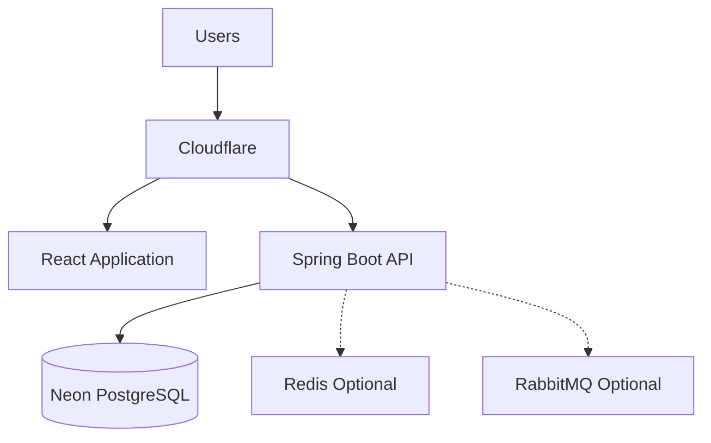

<div align="center">

# AssessFlow

### Multi-tenant live assessment platform built with Spring Boot, React and PostgreSQL


</div>

## Overview

**AssessFlow** is a reusable multi-tenant assessment platform for creating assessments and running live evaluation sessions.

The platform supports two execution modes:

- **Cloud Live**, with hosts and participants connected through the public internet
- **Local Live**, with the same product running on a laptop LAN or hotspot without requiring internet access

Organizations isolate tenants. Authors maintain question banks and build assessments. Instructors launch live sessions with join codes and QR codes, while participants receive real-time updates through WebSocket connections.

## Main Features

- Authentication and refresh-token flows
- Organization-based multi-tenancy
- Role-based access control
- Question banks
- Assessment builder
- Draft, published and archived assessment states
- Live sessions
- Join codes and QR-based entry
- Waiting room and participant reconnect
- WebSocket events
- Answer collection and results
- Local Live mode
- CSV export for finished sessions
- Optional Redis-backed rate limiting
- Optional RabbitMQ STOMP relay
- Metrics, tracing hooks and production health checks

## Architecture


```mermaid
flowchart TD
    USERS[Users]
    CF[Cloudflare]
    WEB[React Application]
    API[Spring Boot API]
    DB[(Neon PostgreSQL)]
    REDIS[Redis Optional]
    RABBIT[RabbitMQ Optional]

    USERS --> CF
    CF --> WEB
    CF --> API
    API --> DB
    API -.-> REDIS
    API -.-> RABBIT
```

### Lean Deployment

The portfolio deployment can run with:

- Cloudflare Pages
- one Spring Boot API replica
- Neon PostgreSQL
- the simple STOMP broker
- an in-memory public rate limiter

### Scaled Deployment

Multiple API replicas can use:

- Redis for shared rate limiting
- RabbitMQ as a STOMP relay
- cross-instance real-time delivery

### Local Live

Local Live uses the same application with:

- Spring Boot serving the SPA
- PostgreSQL on localhost
- the simple STOMP broker
- LAN join URLs
- optional local hotspot networking

## Technology Stack

| Area | Technology |
| --- | --- |
| Backend | Java 25, Spring Boot 4.1.1 |
| Persistence | PostgreSQL 17, Spring Data JPA |
| Migrations | Flyway |
| Frontend | React 19, TypeScript, Vite |
| Real-time communication | WebSocket, STOMP |
| Optional scaling | Redis, RabbitMQ |
| Testing | JUnit, Testcontainers, Vitest, Playwright |
| Observability | Micrometer, optional OTLP traces, ECS logs |
| CI/CD | GitHub Actions, GHCR |
| Deployment | Azure Container Apps, Cloudflare Pages, Neon |

## Local Development

Copy the environment example and start PostgreSQL:

```bash
cp .env.example .env
docker compose up -d postgres
```

Run the backend:

```bash
cd api
./mvnw spring-boot:run
```

Run the frontend:

```bash
cd web
npm ci
npm run dev
```

Local frontend:

```text
http://localhost:5173
```

Backend health:

```text
http://localhost:8080/actuator/health
```

OpenAPI:

```text
http://localhost:8080/swagger-ui/index.html
```

## Testing and Quality

Backend:

```bash
cd api
./mvnw clean verify
```

Frontend:

```bash
cd web
npm ci
npm run format:check
npm run lint
npm test
VITE_SAME_ORIGIN=true npm run build
```

The backend integration suite includes PostgreSQL, Redis and RabbitMQ scenarios through Testcontainers. Frontend end-to-end coverage uses Playwright.

## Production

Publish immutable API images as `ghcr.io/<owner>/assessflow-api:<git-sha>`. Configure the web application with `VITE_API_BASE_URL`, `VITE_PUBLIC_APP_URL` and `VITE_WS_URL`; production values must use HTTPS/WSS and must not point to localhost. Prefer separate `app.<domain>` and `api.<domain>` hosts so the refresh cookie can remain `SameSite=Strict`.

## Security

Security-related controls include:

- BCrypt password hashing
- opaque hashed tokens
- tenant-scoped data access
- WebSocket origin allowlists
- production fail-fast configuration
- dependency automation
- CodeQL analysis
- Trivy container scanning

No open-source licence has been selected for this repository.

## Documentation

Additional documentation is available in:

- [Architecture](docs/architecture.md)
- [Deployment](docs/deployment.md)
- [Local Live](docs/local-live.md)
- [WebSocket](docs/websocket.md)
- [Production checklist](docs/production-checklist.md)

## Academic Origin

AssessFlow evolved from ideas explored in the academic Distributed Quiz Platform, but it is a separate modern web application with its own architecture and repository history.

The academic project focuses on Java sockets, replication and fault tolerance. AssessFlow focuses on Spring Boot, web delivery, multi-tenancy, WebSocket communication and cloud deployment.

## Current Status

The core product architecture, multi-tenancy, live sessions, Local Live mode, optional scaling infrastructure and production deployment foundation are implemented.

Future development should continue to improve the product experience and real-world deployment rather than adding infrastructure without a demonstrated need.
